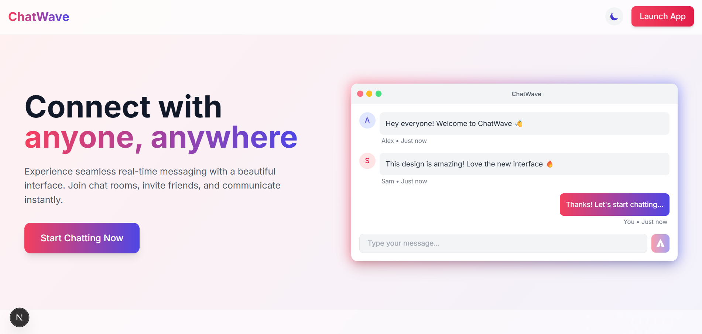
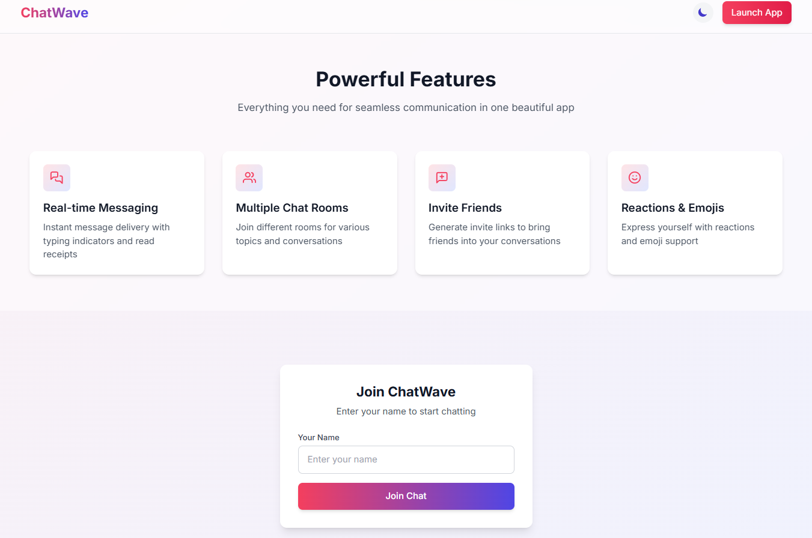
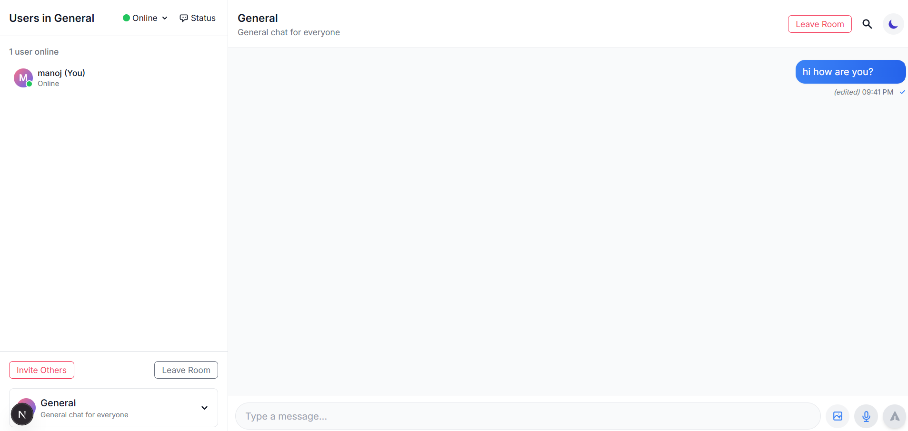
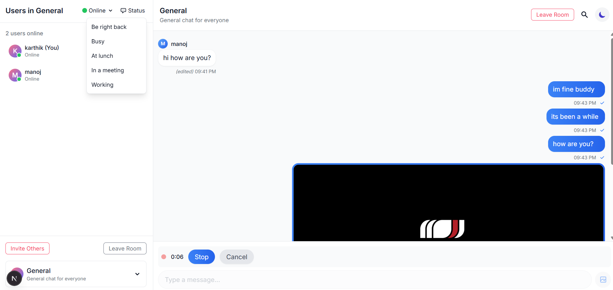

# ChatWave - Real-Time Messaging Application

ChatWave is a modern, feature-rich real-time messaging application built with Next.js and Socket.IO. It provides a seamless chat experience with multiple rooms, user presence indicators, and interactive features.

## Features

- **Real-time messaging** with instant delivery
- **Multiple chat rooms** for different topics
- **User presence** (online, away, offline) indicators
- **Message reactions** with emoji support
- **Message editing** for your own messages
- **Media sharing** (images, audio messages)
- **Dark mode** support
- **Responsive design** for desktop and mobile
- **Invite system** to bring friends to chat rooms
- **Message search** functionality
- **Desktop notifications**
- **Read receipts**

## Installation

### Prerequisites

- Node.js (v14 or newer)
- npm or yarn

### Setup

1. Clone the repository:
   \`\`\`bash
   git clone https://github.com/kingslayer458/Chat-application-enhanced.git

   \`\`\`

2. Install dependencies:
   \`\`\`bash
   npm install or npm install --force
   # or
   yarn install
   \`\`\`

3. Start the development server:
   \`\`\`bash
   node server.js
   npm run dev

   \`\`\`

5. Open [http://localhost:3000](http://localhost:3000) in your browser to see the application.

## Usage

### Getting Started

1. Enter your username on the landing page to join the chat.
2. You'll be automatically directed to the General chat room.
3. Start chatting with other users in real-time!

### Chat Features

#### Sending Messages

- Type your message in the input field at the bottom of the screen and press Enter or click the send button.
- To send an image, click the image icon and select a file from your device.
- To record a voice message, click the microphone icon, record your message, and click "Send".

#### Message Interactions

- **Reactions**: Hover over a message and click the emoji icon to add a reaction.
- **Full Emoji Picker**: 
  - Double-click on a message to open the full emoji picker
  - Right-click on the emoji button to open the full emoji picker
- **Edit Messages**: Hover over your own message and click the edit (pencil) icon to modify it.
- **Edit Last Message**: Press the up arrow key in an empty message input to edit your last message.

#### User Status

- Click on your status indicator to change between Online, Away, and Offline.
- Use quick status updates like "brb", "busy", or "lunch" to let others know what you're doing.

#### Room Management

- Switch between rooms using the room selector at the bottom of the sidebar.
- Invite others to join a room by clicking the "Invite Others" button and sharing the generated link.

#### Search Messages

- Click the search icon in the header to search for messages across all rooms.
- Click on a search result to navigate to that message.

## Project Structure

\`\`\`
chatwave/
├── app/                  # Next.js app directory
│   ├── api/              # API routes
│   ├── chat/             # Chat room pages
│   ├── join/             # Invite join page
│   └── page.tsx          # Landing page
├── components/           # React components
│   ├── chat-window.tsx   # Main chat display
│   ├── message.tsx       # Message component
│   ├── message-input.tsx # Input component
│   └── ...               # Other components
├── contexts/             # React contexts
├── lib/                  # Utility functions and types
├── hooks/                # Custom React hooks
├── server.js             # Socket.IO server
└── public/               # Static assets
\`\`\`

## Technologies Used

- **Next.js**: React framework for the frontend
- **Socket.IO**: Real-time communication
- **Tailwind CSS**: Styling
- **Framer Motion**: Animations
- **TypeScript**: Type safety

## Contributing

Contributions are welcome! Please feel free to submit a Pull Request.

1. Fork the repository
2. Create your feature branch (`git checkout -b feature/amazing-feature`)
3. Commit your changes (`git commit -m 'Add some amazing feature'`)
4. Push to the branch (`git push origin feature/amazing-feature`)
5. Open a Pull Request

